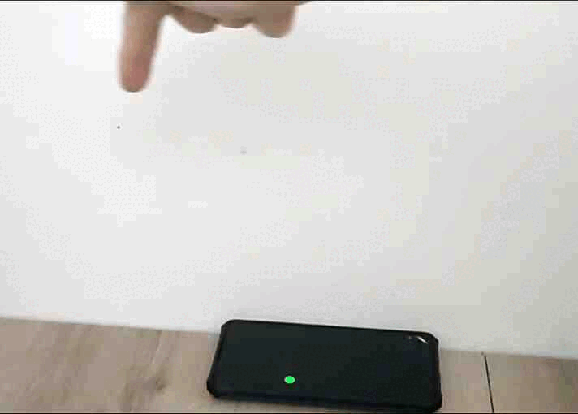

# Flutter Flame Hand Tracking Demo

[](https://opensource.org/license/MIT)



A demonstration project showcasing the integration of real-time hand tracking with the Flame game engine in a Flutter application. The application uses the device's front-facing camera to detect hand landmarks and moves a game object based on the position of the user's index finger.

---

## 🚀 Key Features

* **Real-time Hand Tracking**: Utilizes the camera feed to detect and track hand movements.
* **Flame Engine Integration**: Controls a `Player` component within a Flame game world.
* **Efficient Processing**: Hand landmark detection is offloaded to a separate isolate using `integral_isolates` to ensure the UI remains smooth and responsive.
* **State Management**: Employs `flutter_bloc` to manage the state of hand tracking and communicate updates to the game engine.
* **Cross-Platform (WIP)**: Currently functional on Android. iOS implementation is planned.

## ⚙️ How It Works

The application follows a clear data flow from camera input to game object movement:

1.  **Camera Service**: The `HandTrackingService` initializes the `camera` plugin and configures it to stream image frames.
2.  **Isolate Processing**: Each camera frame is passed to a dedicated background isolate.
3.  **Hand Detection**: Inside the isolate, the `hand_landmarker` package processes the image frame using the MediaPipe Hand Landmarker model to detect hand keypoints.
4.  **State Emission**: The detected landmark data is sent back to the main isolate, where `HandTrackingCubit` emits a new `HandTrackingSuccess` state containing the hand coordinates.
5.  **Game Logic**: A `Controller` component within the Flame game listens for state changes from the `HandTrackingCubit`.
6.  **Player Movement**: Upon receiving a new state with hand data, the `Controller` updates the position of the `Player` component, moving it to correspond with the index finger's location on the screen. A smoothing algorithm (`lerp`) is applied for fluid motion.

## 📂 Project Structure

```bash
lib/
├── cubit/
│   ├── hand_tracking_cubit.dart    # BLoC cubit for managing hand tracking state
│   └── hand_tracking_state.dart    # States for the cubit (Initial, Loading, Success, Failure)
├── game/
│   ├── components/
│   │   ├── controller.dart         # Flame component that listens to the BLoC and controls the player
│   │   ├── player.dart             # The player (circle) component in the game
│   │   └── status.dart             # Text component to show detection status
│   ├── finger_tracking_game.dart   # The main Flame game class
│   └── game.dart                   # Main widget that hosts the GameWidget
├── models/
│   └── hand_landmark.dart          # Enum for MediaPipe hand landmark points
├── services/
│   └── hand_tracking_service.dart  # Service to manage the camera and hand landmarker plugin in an isolate
└── main.dart                       # Application entry point
```

## 📦 Core Dependencies

| Dependency          | Version                                                                                             | Description                                                |
| ------------------- | --------------------------------------------------------------------------------------------------- | ---------------------------------------------------------- |
| `flame`             | [](https://pub.dev/packages/flame)             | A minimalist 2D game engine for Flutter.                   |
| `flame_bloc`        | [](https://pub.dev/packages/flame_bloc)   | Integrates BLoC state management with Flame.               |
| `hand_landmarker`   | [](https://pub.dev/packages/hand_landmarker) | A Flutter plugin for the MediaPipe Hand Landmarker task.   |
| `camera`            | [](https://pub.dev/packages/camera)           | A Flutter plugin for using the device's cameras.           |
| `flutter_bloc`      | [](https://pub.dev/packages/flutter_bloc) | State management library.                                  |
| `integral_isolates` | [](https://pub.dev/packages/integral_isolates) | Simplifies working with isolates.                          |

## 📱 Platform Support

| Platform | Supported | Tested |
| :------- | :-------: | :----: |
| **Android**| ✅        | ✅     |
| **iOS** | 🚧        | ❌     |

## 🛠️ Setup and Installation

### Prerequisites
* Flutter SDK
* An Android device (Minimum SDK version 24).

### Installation
1.  **Clone the repository:**
    ```bash
    git clone [https://github.com/your-username/flutter_flame_finger_tracking_demo.git](https://https://github.com/IoT-gamer/flutter_flame_finger_tracking_demo.git)
    cd flutter_flame_finger_tracking_demo
    ```

2.  **Get Flutter packages:**
    ```bash
    flutter pub get
    ```

3.  **Run the application:**
    ```bash
    flutter run
    ```

## 🎮 Usage

1.  Launch the application on a supported device.
2.  Grant camera permissions when prompted.
3.  The app will activate the front-facing camera.
4.  Position your hand in front of the camera. A green circle will appear on the screen.
5.  Move your index finger to control the movement of the circle.

## ❗ Troubleshooting
* Ensure you have the necessary permissions to access the camera.
* If `no hand detected` appears, try adjusting the lighting or moving your hand back from the camera or try slower motion.

## 📄 License

This project is licensed under the MIT License - see the [LICENSE](LICENSE) file for details.

